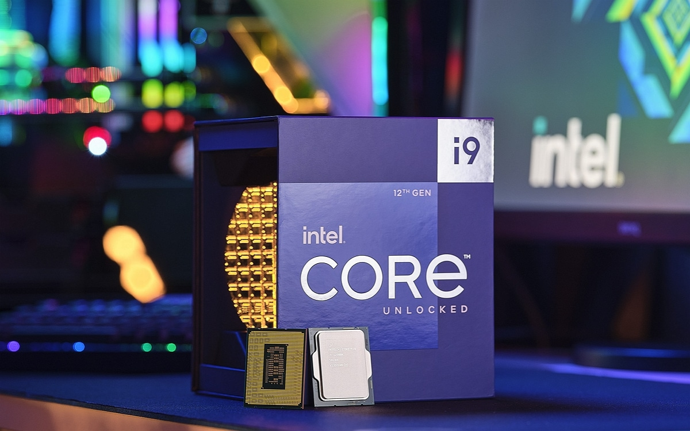

# Процессоры, типы и основные

## Микропроцессор — это процессор, выполненный в виде большой интегральной схемы и заключённый в герметический корпус.  В основе любой ПЭВМ лежит использование микропроцессоров.
*Микропроцессор является «мозгом» компьютера.* 

Разрядность характеризует объём информации, который микропроцессор обрабатывает за одну операцию: 8-разрядный процессор за одну операцию обрабатывает 8 бит информации, 32-разрядный — 32 бита. Скорость его работы во многом определяет быстродействие компьютера.

На любом процессорном кристалле находятся: собственно процессор-главное вычислительное устройство, сопроцессор -спец. блок, который применяется для особо точных и сложных расчетов, кэш-память первого уровня -небольшая сверхбыстрая память, предназначена для промежуточных результатов вычислений, кэш-память второго уровня — эта память чуть помедленнее, зато больше.

## Характеристики микропроцессоров
Микропроцессоры отличаются  друг  от друга двумя характеристиками:  типом (моделью) и тактовой частотой. Одинаковые модели микропроцессоров могут иметь разную тактовую частоту — чем выше тактовая частота,  тем выше производительность и цена микропроцессора.

Тактовая частота  показывает,  сколько элементарных  операций(тактов) микропроцессор выполняет в одну секунду.

Кэш-памяти в процессоре имеется двух видов. Самая быстрая — кэш-память первого уровня. Существует еще чуть менее быстрая, но объемная кэш-память второго уровня.

Перечислим основные функции микропроцессора:

выборка команд из ОЗУ;
декодирование команд (т.е. определение назначения команды, способа ее исполнения и адресов операндов);
выполнение операций, закодированных в командах;
управление пересылкой информации между своими внутренними регистрами, оперативной памятью и внешними (периферийными) устройствами;
обработка внутрипроцессорных и программных прерываний;
обработка сигналов от внешних устройств и реализация соответствующих прерываний;
управление различными устройствами, входящими в состав компьютера.

